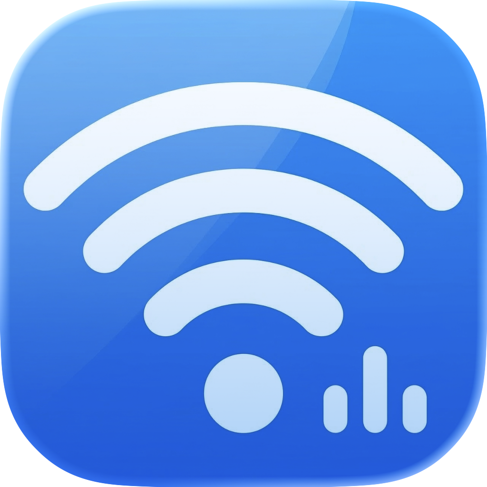
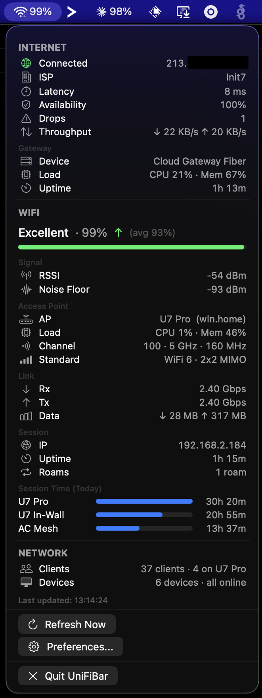

<div align="center">



# UniFiBar

**Real-time UniFi WiFi monitoring in your macOS menu bar.**

Monitor WiFi signal strength, latency, throughput, roaming, and network health — all from your menu bar. Built for Ubiquiti UniFi users who want instant visibility into their wireless connection.

[](https://swift.org)
[](https://developer.apple.com/macos/)
[](LICENSE)



</div>

## Features

- **WiFi Experience Score** — real-time satisfaction percentage with trend indicators
- **Signal Monitoring** — RSSI, noise floor, and signal quality trends
- **Access Point Details** — current AP, channel, WiFi standard, MIMO configuration
- **Link Speeds** — Rx/Tx rates, session data transfer totals
- **Roaming Detection** — alerts when your Mac switches between access points
- **Internet Health** — WAN status, ISP name, latency, availability, packet drops
- **Gateway Monitoring** — CPU, memory, uptime of your UniFi gateway
- **WAN Throughput** — real-time upload/download speeds
- **VPN Tunnels** — site-to-site VPN tunnel status (gateway-level, not client VPN apps)
- **Network Overview** — total clients, devices online/offline, firmware updates
- **Session History** — daily roaming breakdown by access point
- **Launch at Login** — optional autostart via macOS login items
- **Self-Signed Certificates** — works with custom SSL setups

## Supported Hardware

Tested with **Ubiquiti UniFi** network equipment:

- **Gateways**: Cloud Gateway Fiber (UCG Fiber), UniFi Dream Machine (UDM), UDM Pro, UDR, UXG
- **Access Points**: U7 Pro, U7 In-Wall, U6, AC Mesh, and all UniFi APs
- **Requires**: UniFi Network Application 10.1.85+ with API key support

## Requirements

- macOS 26 (Tahoe)
- Xcode 26+ command line tools
- A UniFi API key (Settings → Integrations → Generate API Key)

## Build & Install

```bash
git clone https://github.com/darox/UniFiBar.git
cd UniFiBar
Scripts/package_app.sh
cp -r .build/release/UniFiBar.app /Applications/
open /Applications/UniFiBar.app
```

For development:

```bash
Scripts/compile_and_run.sh
```

## Setup

1. Open UniFiBar from the menu bar
2. Enter your UniFi controller URL (e.g. `https://192.168.1.1`)
3. Paste your API key (generate in UniFi → Settings → Integrations)
4. Enable "Allow self-signed certificates" if needed
5. UniFiBar automatically detects your Mac on the network and starts monitoring

## How It Works

UniFiBar connects to your UniFi controller's API and identifies your Mac by matching its local IP address against active clients. It polls every 30 seconds for updated metrics and reacts instantly to network changes and wake-from-sleep events.

**Data sources:**
- Official UniFi Integration API — clients, devices, sites
- Legacy UniFi API — WAN health, session history

All credentials are stored securely in the macOS Keychain. No data leaves your local network.

## Tech Stack

- **Swift 6** with strict concurrency
- **SwiftUI** with Liquid Glass materials (macOS 26)
- **SwiftPM** — no Xcode project required
- **async/await** with actor isolation for thread safety

## License

MIT
